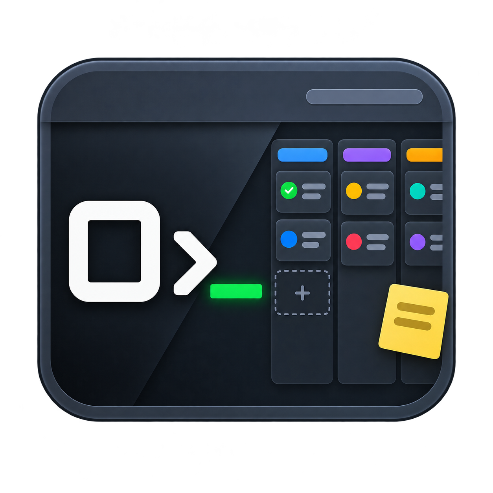

  

<h1 align="center">Orchboard</h1>

  An agentic project board for Claude Code and Codex: plan, queue, and track your AI coding agents across every project.

  
  

## Community

Questions, ideas, or feedback? [Join the Discord](https://discord.gg/JRHBcwzUag).

## License

[MIT](LICENSE) © Blaketon
